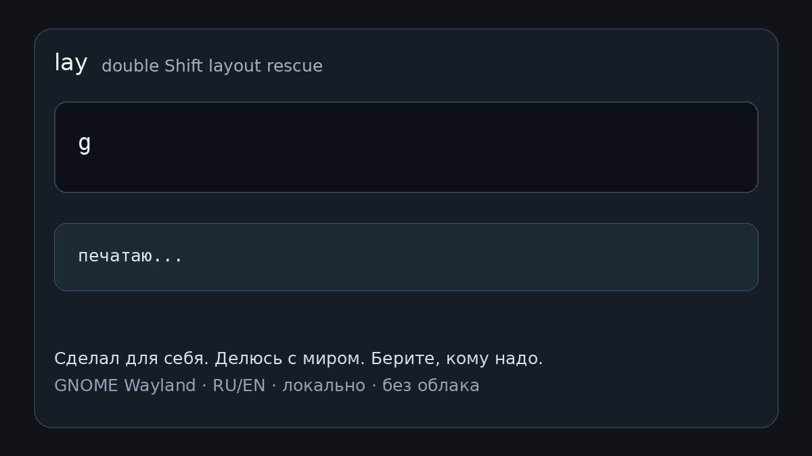

<div align="center">

# lay

**Спасатель неправильной RU/EN раскладки для Linux**

**Double Shift RU/EN layout rescue for Linux desktops**

Напечатал слово не в той раскладке? Нажми **Shift два раза** и продолжай писать.

```bash
curl -fsSL https://raw.githubusercontent.com/radislabus-star/lay-public/main/scripts/install-remote.sh | bash
```

[](https://www.rust-lang.org/)
[](https://gnome.org/)
[](https://wayland.freedesktop.org/)
[](#license)

</div>

## Русский

### Зачем появился lay

На Windows я привык к Caramba Switcher. Это была одна из тех маленьких утилит,
которые почти не замечаешь, пока они есть: набрал слово не в той раскладке,
нажал привычную горячую клавишу, слово перевернулось, можно писать дальше.

После перехода на Linux я ожидал найти что-то такое же простое. Нашёл несколько
похожих проектов, но одни выглядели устаревшими, другие не работали в моём
GNOME Wayland окружении, третьи решали задачу не так, как мне хотелось. Мне
нужно было не большое приложение-автокорректор, а один конкретный рефлекс:
нажал Shift два раза — последнее слово перепечаталось в другой раскладке.

Я не нашёл готовую утилиту, которая делала бы это достаточно стабильно, поэтому
написал свою.

Делал для себя и делюсь с миром. Если тебе тоже нужно лёгкое исправление слов
по двойному Shift — бери, пробуй, присылай короткие воспроизводимые баги.

`lay` — маленький клавиатурный помощник для Linux-пользователей, которые часто
пишут в двух раскладках, прежде всего **русской и английской**.

Главный сценарий простой:

```text
Напечатал: Ghbdtn
Нажал:     Shift Shift
Получил:   Привет
```



`lay` не пытается “угадать всё за тебя”. Базовое поведение ручное и
предсказуемое: ошибся раскладкой, нажал двойной Shift, последнее слово
перепечаталось в другой раскладке.

Основная проверенная среда сейчас **GNOME Wayland**. Внутри: Rust, evdev/uinput
и backend-слой для переключения раскладки. GNOME backend использует маленькое
расширение GNOME Shell; KDE и X11 backend добавлены как экспериментальные.

### Возможности

- Двойной Shift исправляет последнее слово, набранное не в той раскладке.
- Работает прямо в приложениях, без копирования текста через буфер обмена.
- Поддерживает GNOME Wayland через маленькое Shell-расширение.
- Имеет экспериментальные backend-режимы для KDE и X11.
- Есть быстрый CLI для конвертации текста из терминала.
- Есть аккуратная помощь при наборе после пробела.
- Есть точная автоподмена по пользовательскому словарю.
- Есть режим `ptah_alexs`: жёсткая привязка раскладки к выбранным окнам.
- Основной режим локальный: без облака, без сетевых запросов и без модели.

### Статус

Это ранняя публичная beta-версия.

Основная проверенная среда: Ubuntu/GNOME Wayland с RU/EN раскладками.
Расширение заявляет поддержку GNOME Shell 45, 46, 47 и 50.

KDE и X11 backend появились после обсуждения на Linux.org.ru и пока считаются
экспериментальными:

- `layout_backend = "gnome"`: GNOME Shell extension + DBus bridge.
- `layout_backend = "kde"`: `qdbus/qdbus6 org.kde.keyboard /Layouts setLayout`.
- `layout_backend = "x11"`: `xkb-switch`, `xkblayout-state` или fallback
  `setxkbmap`.

Другие версии GNOME, дистрибутивы, Sway, Hyprland и раскладки кроме RU/EN могут
потребовать доработок.

Если присылаешь баг-репорт или пример набора, сначала убери приватный текст.

### Установка

Обычная установка ставит всё сразу: Rust-бинарники, user systemd-сервис
`lay-daemon` и GNOME Shell extension.

Короткая установка одной командой:

```bash
curl -fsSL https://raw.githubusercontent.com/radislabus-star/lay-public/main/scripts/install-remote.sh | bash
```

Она поставит базовые зависимости, Rust, скачает `lay` в `~/projects/lay` и
запустит `install.sh`.

Ручной вариант:

```bash
git clone https://github.com/radislabus-star/lay-public.git ~/projects/lay
cd ~/projects/lay
bash install.sh
```

После установки выйди из сессии и зайди снова. Это нужно, чтобы применились
группа `input` и расширение GNOME.

Потом набери слово не в той раскладке и нажми **Shift два раза**.

### Обновление

Если `lay` установлен из git-копии, обновление одной командой:

```bash
cd ~/projects/lay
bash update.sh
```

Скрипт делает `git pull --ff-only`, пересобирает release-бинарники, обновляет
GNOME extension и перезапускает `lay-daemon`.

### Extension ZIP

Для ручной установки GNOME-расширения или отправки на extensions.gnome.org можно
собрать ZIP:

```bash
bash scripts/package-extension.sh
```

Архив появится в:

```text
dist/gnome-extension/lay@radislabus-star.github.io-<version>.zip
```

Установить только расширение можно так:

```bash
gnome-extensions install --force dist/gnome-extension/lay@radislabus-star.github.io-<version>.zip
gnome-extensions enable lay@radislabus-star.github.io
```

Но для полной работы double Shift всё равно нужен `lay-daemon`, поэтому для
обычных пользователей предпочтителен `bash install.sh`.

### Требования

- Linux
- GNOME Shell 45, 46, 47 или 50
- Wayland-сессия
- Rust 1.75+
- доступ к `/dev/input` через группу `input`
- поддержка `uinput`

Для экспериментального KDE backend нужен `qdbus` или `qdbus6`. Для
экспериментального X11 backend лучше иметь `xkb-switch`; без него используется
fallback через `setxkbmap`, который может менять текущую XKB-конфигурацию
грубее, чем специализированные tools.

Установщик может добавить текущего пользователя в группу `input`, но это
начинает работать только после нового входа в систему.

### CLI

`lay` можно использовать и из терминала:

```bash
lay "Ye djn ghbvth"
# Ну вот пример

lay "руддщ цщкдв"
# hello world

echo "ghbdtn" | lay
# привет

lay --clipboard
```

CLI удобен для быстрых проверок, скриптов и конвертации буфера обмена.

### Демон

`lay-daemon` — фоновый сервис, который делает двойной Shift рабочим в обычных
приложениях.

Полезные команды:

```bash
systemctl --user status lay-daemon --no-pager
systemctl --user restart lay-daemon
systemctl --user stop lay-daemon
journalctl --user -u lay-daemon -n 120 --no-pager
```

### GNOME-расширение

Демон читает физические клавиши и перепроигрывает keycode-события, но на GNOME
Wayland переключение раскладки требует интеграции с GNOME Shell.

Исходники расширения:

```text
extension/lay@radislabus-star.github.io/
```

Установленная копия:

```text
~/.local/share/gnome-shell/extensions/lay@radislabus-star.github.io/
```

### Меню в трее

Меню держит основной сценарий коротким:

- `Помощь при наборе`: осторожная правка после пробела.
- `Автоподмена`: точные пользовательские правила и typo-правки.
- `Запоминать правки`: opt-in лог подтверждённых исправлений.
- `Режим`: Replay или Smart.
- `Область`: сколько слов брать для ручного double Shift.
- `Арбитр`: LEM и auto-layout настройки.
- `ptah_alexs`: жёсткая раскладка по окну.
- `Коррекция`: включение/выключение слоёв помощника.
- `Триггер`, `Тайминг`, `Daemon`, `О программе`: сервисные настройки.

В публичном режиме нет кнопки для открытия сырого debug-лога.

### Как это работает

При двойном Shift:

```text
физическая клавиатура -> evdev -> lay-daemon
                                  |
                                  v
                           буфер текущего слова
                                  |
                                  v
                        Backspace x длина слова
                                  |
                                  v
                 GNOME extension переключает раскладку
                                  |
                                  v
                    uinput повторяет исходные keycode
```

То есть `lay` не вставляет “готовое слово” из облака или буфера. Он повторяет
те же физические клавиши уже под другой раскладкой. Поэтому `Ghbdtn` становится
`Привет`.

### Помощь при наборе

Дополнительно `lay` умеет после пробела запускать консервативный помощник.
Это отдельная функция, не основной double-Shift сценарий.

Помощник специально осторожный:

- проверяет только завершённые слова;
- исправляет только уверенные локальные ошибки;
- использует точные правила, словари и char n-gram scorer;
- не переписывает стиль и не генерирует новый текст;
- если не уверен, ничего не делает.

Примеры задуманных исправлений:

```text
ошисбя -> ошибся
я вно  -> явно
плозо  -> плохо
```

Включается и выключается в трее:

```json
{
  "typing_assist": true,
  "auto_switch_layout": true
}
```

`auto_switch_layout` управляет автоматическими layout-правками после пробела:
если слово уверенно похоже на набор в неправильной раскладке, helper заменит
его и оставит активной раскладку исправленного текста. Ручной double Shift
переключает раскладку всегда.

### Автоподмена

Точные автоподмены лежат здесь:

```text
~/.config/lay/replacements.json
```

Пример:

```json
{
  "подлючись": "подключись",
  "Надйи": "Найди"
}
```

Это именно точные правила. Нечёткие исправления относятся к typing assist, а не
к словарю автоподмены.

### Режим ptah_alexs

`ptah_alexs` — это не память последней раскладки окна. Это жёсткая политика:
когда конкретное окно получает фокус, `lay` ставит назначенную раскладку.

Пример:

```text
Terminal -> EN
Browser  -> не трогать
```

Если терминал получил фокус, `lay` снова поставит EN, даже если раньше внутри
него случайно включали RU. Правила задаются из трея: `ptah_alexs -> Текущее
окно -> EN/RU/keep`.

Конфиг хранится локально:

```json
{
  "ptah_alexs_mode": true,
  "ptah_alexs_rules": [
    {"kind": "app_id", "value": "org.gnome.Terminal.desktop", "layout": "us", "label": "Terminal"}
  ]
}
```

### Приватность

К клавиатурным инструментам нужно относиться подозрительно. `lay-daemon` видит
клавиатурные события, поэтому модель данных сделана максимально скучной и
локальной.

По умолчанию `lay` никуда не отправляет набранный текст. Нормальный путь
double Shift не требует сети, облачных API или удалённой модели.

Опциональный learning log локальный. Он должен хранить пары подтверждённых
исправлений, а не полный поток набора. По умолчанию он выключен и включается в
трее через `Данные -> Запоминать правки`:

```text
~/.local/share/lay/corrections.jsonl
```

Диагностический вывод тоже выключен по умолчанию. Разработчик может включить
его явно через `lay-daemon --debug-log` или `LAY_DEBUG_LOG=1`.

GNOME-расширение публикует session-local DBus bridge, чтобы `lay-daemon` мог
переключать раскладку и делать fallback-вставку текста. Это не является
security boundary против других процессов того же desktop-пользователя.

Остановить демон можно в любой момент:

```bash
systemctl --user stop lay-daemon
```

### Smart/LLM режим

Есть экспериментальный `--smart` режим, где локальная модель может быть
арбитром между уже подготовленными кандидатами.

Это не главный путь продукта, не обязательная часть double Shift и не включено
для обычного исправления раскладки.

`Ещё -> LLM` в трее влияет только на `lay-daemon`. CLI использует модельную
логику только если передан `--smart`.

Обычная сборка не компилирует direct GGUF backend и не грузит модель при
старте. Для экспериментов с Ollama:

```bash
LAY_LLM_BACKEND=ollama lay --smart "fyukbqcrbq"
```

Для optional direct GGUF backend:

```bash
cargo build --release --features direct-llm
LAY_LLM_BACKEND=direct LAY_GGUF_MODEL=/path/to/model.gguf lay --smart "fyukbqcrbq"
```

### Разработка

```bash
cargo test
cargo build --release
```

N-gram helpers:

```bash
cargo run --bin lay-ngram-corpus -- check-cache
cargo run --bin lay-ngram-corpus -- check --corpus corpus/ru_50mb.txt
```

Установка текущей сборки локально:

```bash
bash install.sh
```

### Roadmap

- Uninstall-команда и более дружелюбный release-пакет.
- Короткий demo GIF/video для double Shift.
- Больше регрессионных тестов из реальных принятых/отклонённых исправлений.
- Ещё более понятные privacy-настройки.
- Довести KDE/X11 backend до подтверждённого рабочего статуса на чужих системах.
- Исследование Sway/Hyprland.
- Другие раскладки после стабилизации RU/EN.

## English

`lay` is a lightweight keyboard helper for Linux users who type in two layouts,
especially **RU/EN**.

The main workflow:

```text
Typed:   Ghbdtn
Press:   Shift Shift
Result:  Привет
```

`lay` is primarily tested on GNOME Wayland. It uses Rust, evdev/uinput, and a
layout backend layer. GNOME uses a small Shell extension; KDE and X11 backends
are experimental. The normal path is local-first: no cloud service, no network
call, and no model required.

Quick install:

```bash
curl -fsSL https://raw.githubusercontent.com/radislabus-star/lay-public/main/scripts/install-remote.sh | bash
```

Manual install:

```bash
git clone https://github.com/radislabus-star/lay-public.git ~/projects/lay
cd ~/projects/lay
bash install.sh
```

After installation, log out and log back in so the `input` group and GNOME
extension are picked up.

Update an existing git install:

```bash
cd ~/projects/lay
bash update.sh
```

Extension ZIP for manual install or extensions.gnome.org upload:

```bash
bash scripts/package-extension.sh
gnome-extensions install --force dist/gnome-extension/lay@radislabus-star.github.io-<version>.zip
gnome-extensions enable lay@radislabus-star.github.io
```

The extension alone is only the GNOME Shell bridge and tray UI. The full
double-Shift workflow also needs `lay-daemon`, so normal users should use
`bash install.sh`.

Supported/tested target:

- Linux
- GNOME Shell 45, 46, 47, or 50
- Wayland session
- Rust 1.75+
- RU/EN layouts

Experimental:

- KDE backend via `qdbus/qdbus6 org.kde.keyboard /Layouts setLayout`.
- X11 backend via `xkb-switch`, `xkblayout-state`, or `setxkbmap` fallback.
- `ptah_alexs` window policy mode for GNOME: force a selected window/app to RU,
  EN, or keep.

Useful CLI examples:

```bash
lay "Ye djn ghbvth"
# Ну вот пример

lay "руддщ цщкдв"
# hello world

echo "ghbdtn" | lay
# привет
```

Privacy summary: `lay-daemon` reads keyboard events locally to provide the
double-Shift workflow. By default it does not send typed text anywhere, does not
require a remote model, and does not keep a full keylog. Optional learning logs
are local and disabled by default.

Experimental Smart/LLM mode exists, but it is not the default product path. The
default build does not compile direct GGUF support. Use `--features direct-llm`
and explicit `LAY_LLM_BACKEND=direct` only for local model experiments.

## License

MIT
