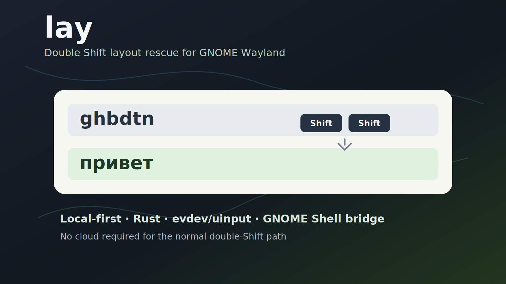

# Я устал от неправильной раскладки и написал double-Shift помощник для GNOME Wayland

> Черновик для Хабра. Тон: личный инженерный опыт, без рекламного нажима.
> Репозиторий: https://github.com/radislabus-star/lay-public



## Коротко

Я часто печатаю на русском и английском вперемешку. Ошибка знакомая:
хочешь написать `привет`, а получается `ghbdtn`.

На X11 такие задачи исторически решались проще: можно было перехватить ввод,
посмотреть активное окно, поменять текст или раскладку. На GNOME Wayland всё
строже. И это правильно с точки зрения безопасности, но неудобно, если хочется
маленькую утилиту в духе Punto Switcher/Caramba, только локальную и
предсказуемую.

Так появился `lay`: маленький помощник для GNOME Wayland, который исправляет
последнее слово по двойному Shift и умеет осторожно помогать при наборе после
пробела.

```text
ghbdtn          -> привет
good ntrcn     -> good текст
перпаратов     -> препаратов
wi-fi ye       -> wi-fi ну
```

Проект ранний, но уже стал для меня ежедневным инструментом.

## Что я хотел получить

Главное требование было простым: если я понял, что набрал слово не в той
раскладке, я не должен удалять его руками, переключать язык и печатать заново.

Я хотел нажать Shift два раза и продолжить писать.

Но быстро выяснилось, что одного "перевернуть последнее слово" мало. Реальные
ошибки выглядят грязнее:

- одно слово русское, второе набрано в английской раскладке;
- рядом лежит английский технический токен вроде `AmoCRM`, `API`, `wi-fi`;
- пользователь нажал пробел слишком рано;
- в слове переставлены две соседние буквы;
- хочется исправлять только очевидные случаи, а не получать агрессивный
  автокорректор, который спорит с автором.

Поэтому `lay` постепенно вырос из "переключателя раскладки" в клавиатурный
рефлекс: маленький локальный демон, который понимает ограниченный набор
ситуаций и молчит, если не уверен.

## Почему не просто буфер обмена

Самый простой вариант для такой утилиты: скопировать последнее слово, обработать
его, вставить обратно.

Я от него отказался.

Причины:

- буфер обмена не должен мигать и портиться от каждого исправления;
- не все приложения одинаково ведут себя при вставке;
- терминалы и мессенджеры иногда дают разные сюрпризы;
- Wayland не любит глобальные трюки с чужим текстом;
- для приватности лучше не строить архитектуру вокруг копирования текста.

В нормальном double-Shift пути `lay` не вставляет готовую строку из буфера. Он
удаляет слово backspace-ами, переключает раскладку через GNOME Shell и
проигрывает те же физические keycode-события через uinput.

Упрощенно:

```text
physical keyboard
    -> evdev
    -> lay-daemon
    -> word buffer
    -> Backspace x N
    -> GNOME Shell extension switches layout
    -> uinput replays original keycodes
```

Если было набрано `ghbdtn`, программа не "знает магически слово привет". Она
повторяет те же клавиши уже в русской раскладке.

## Архитектура

Проект состоит из двух частей.

`lay-daemon` на Rust:

- слушает физические клавиши через evdev;
- хранит небольшой буфер текущего слова;
- распознает double Shift;
- делает backspace/replay через uinput;
- применяет smart-логику для двух слов;
- запускает осторожную помощь после пробела.

GNOME Shell extension на GJS:

- показывает меню в трее;
- переключает раскладку внутри GNOME Shell;
- экспортирует маленький session-local DBus bridge;
- даёт fallback-вставку текста там, где нужен именно текстовый commit.

CLI тоже есть:

```bash
lay "Ye djn ghbvth"
# Ну вот пример

lay "руддщ цщкдв"
# hello world
```

## Самая сложная часть: два слова

На бумаге всё легко:

```text
Главное Вщгиду -> Главное Double
```

Первое слово уже нормальное русское, второе набрано не в той раскладке. Нужно
исправить только второе.

Но есть обратные случаи:

```text
good ntrcn -> good текст
```

Первое слово английское, оно должно остаться на месте. Второе надо перевернуть.

И есть технические токены:

```text
AmoCRM Z тут задача -> AmoCRM Я тут задача
wi-fi ye            -> wi-fi ну
```

Если тупо переворачивать два слова целиком, получается мусор. Поэтому в проекте
появилась tokenwise-логика:

1. последнее незавершенное слово всегда можно перевернуть по физическим
   событиям;
2. предыдущее слово надо сначала классифицировать;
3. хорошие русские и английские слова не трогать;
4. технические ASCII-токены защищать;
5. непонятные слова лучше оставить как есть;
6. если меняется только середина хвоста, не перепечатывать соседние хорошие
   слова.

То есть `lay` старается менять минимальный плохой диапазон, а не весь текст.

## Почему LLM не стала главным решением

Я экспериментировал с маленькими локальными моделями. Идея была соблазнительная:
пусть модель решает, какое слово выглядит естественнее.

Но для основной горячей клавиши LLM оказалась не тем инструментом.

Проблема не только в скорости. Проблема в критерии. Пользователь нажал double
Shift явно. Если он хочет превратить `Double` в `Вщгиду`, программа не должна
говорить: "Нет, Double выглядит нормальным английским словом, я лучше оставлю".

Для ручного действия важнее предсказуемость.

В итоге основной путь такой:

- deterministic layout mapping;
- RU/EN словари;
- char n-gram scorer;
- маленькие эвристики для защищенных токенов;
- LLM только как экспериментальный арбитр для неоднозначных случаев.

Это скучнее, зато быстрее и честнее по отношению к пользователю.

## Помощь при наборе после пробела

Позже появился отдельный режим: typing assist.

Он не срабатывает на каждую клавишу. Он смотрит только завершенный хвост после
пробела и исправляет очень ограниченный набор ошибок:

```text
рабоатет     -> работает
ошисбя       -> ошибся
я вно        -> явно
перпаратов   -> препаратов
njkmrj       -> только
```

Здесь важно слово "ограниченный". Я не хочу, чтобы помощник переписывал стиль,
додумывал смысл или спорил с автором. Он должен быть похож на хорошую
механическую привычку: помог, когда уверен; промолчал, когда не уверен.

## Приватность

Клавиатурная утилита должна вызывать здоровую подозрительность.

Что сейчас делает `lay`:

- работает локально;
- обычный double Shift не требует сети;
- не отправляет набранный текст в облако;
- не ведет полный keylog;
- optional learning log выключаемый и локальный;
- статистика хранит счетчики, а не поток набора.

Да, `lay-daemon` видит клавиатурные события. Иначе такую задачу на Wayland
решить нельзя. Поэтому я стараюсь держать модель данных скучной и проверяемой.

## Где было больно

Самые неприятные баги были не алгоритмические, а поведенческие:

- приложение не успевало стереть один символ перед вставкой;
- терминал вел себя не так, как GTK-поле;
- `wi-fi` нельзя было портить как обычное слово;
- `AmoCRM` надо было защищать как брендовый ASCII-токен;
- два слова нельзя было жестко привязывать к LLM;
- переключение раскладки не должно ломаться после smart-вставки;
- автопомощь не должна превращать нормальное `отлично` в несуществующую
  "улучшенную" форму.

Большая часть разработки ушла не на "как перевести ghbdtn", а на то, как не
мешать человеку в соседних случаях.

## Текущий статус

Сейчас это beta для GNOME Wayland и RU/EN раскладок.

Проверялось на Ubuntu/GNOME Wayland. Extension заявляет поддержку GNOME Shell
45, 46, 47 и 50.

KDE, Sway, Hyprland и другие раскладки пока не цель первого релиза. Там нужно
другое интеграционное решение.

Установка:

```bash
git clone https://github.com/radislabus-star/lay-public.git ~/projects/lay
cd ~/projects/lay
bash install.sh
```

После установки нужен новый вход в сессию, чтобы применились группа `input` и
GNOME extension.

## Что дальше

Ближайшие задачи:

- короткий demo GIF/video;
- более аккуратный installer/uninstaller;
- больше регрессионных тестов из реальных ошибок;
- лучшее объяснение privacy-модели;
- отдельное исследование KDE/Sway/Hyprland;
- осторожное развитие typing assist без превращения его в агрессивный
  автокорректор.

Репозиторий:

https://github.com/radislabus-star/lay-public

Если вы тоже живете между RU/EN раскладками на GNOME Wayland, буду рад багам,
идеям и особенно коротким воспроизводимым примерам.

